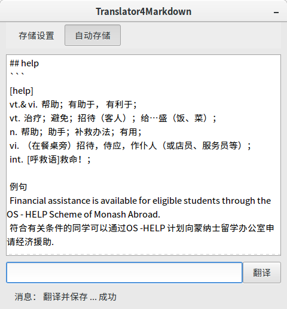
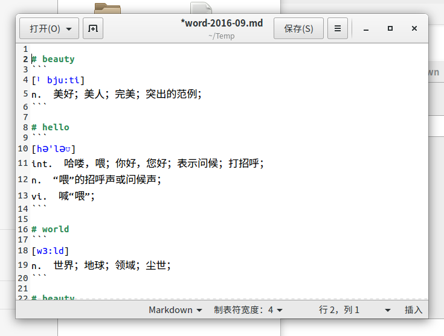

# Translate2Markdown

>> Translate2Markdown is a gtk3+gobject client to translate English word to Chinese by using public translate api provides by [iciba](http://www.iciba.com/) and store it as a markdown file.
>> This application is tested in ubuntu 16.04, however other linux distributions and windows should works as well. 

>> Translate2Markdown 是一个采用能够GTK3+GObject编写的翻译客户端，使用[金山词霸](http://www.iciba.com/)的公开API，在线将英文翻译为中文并存储为MarkDown文件。
>> 该应用在16.04下完全测试，但是其他的Linux发行版本或者Windows应该也能很好的工作。

* Run
    python3 main.py

* Made by
    * Python
    * PyGObject
    * Glade

* Depends
    * Python
    * Gtk3

## The application pages
* Main Page

* Markdown File

